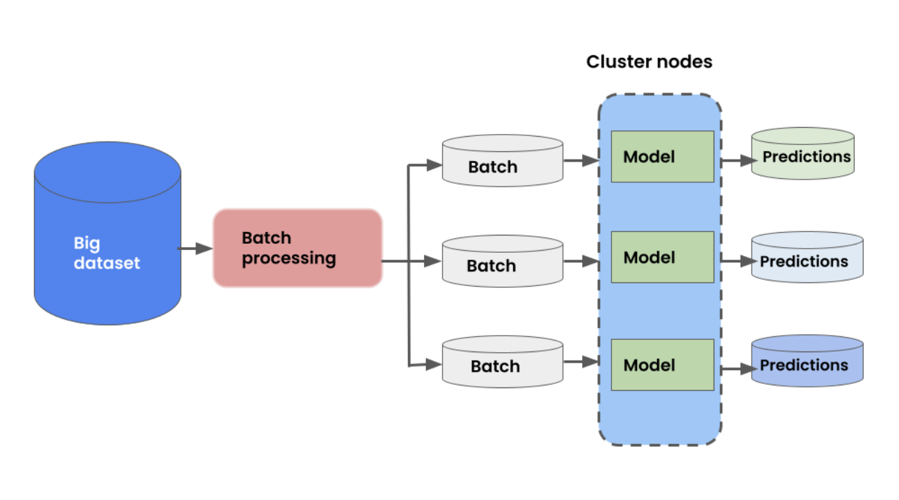

# Batch Inference Benchmarking

This repo contains benchmarks for batch inference benchmarking using Ray, Spark and Sagemaker Batch Transform.

We use the image classification task from the [MLPerf Inference Benchmark suite](https://arxiv.org/pdf/1911.02549.pdf) in the offline setting.
    
- Images from [ImageNet 2012 Dataset](https://image-net.org/challenges/LSVRC/2012/2012-downloads.php#Images)
- [PyTorch ResNet50 model](https://pytorch.org/vision/main/models/generated/torchvision.models.resnet50.html)

The workload is a simple 3 step pipeline:

Images are stored in parquet format (with ~1k images per parquet file) and are read from S3 from within the same region.

## 10 GB
In-memory dataset size is 10 GB. 10 GB dataset. The compressed on-disk size is much smaller.

All experiments used PyTorch v1.12.1 and CUDA 11.3

## Configurations

### Ray
- 1 `gd4n.12xlarge` instance. Contains 48 CPUs and 4 GPUs.
- Experiments were all run on the [Anyscale platform](https://www.anyscale.com/).
- Uses [Ray Data](https://docs.ray.io/en/latest/data/dataset.html) [nightly version](https://docs.ray.io/en/latest/ray-overview/installation.html#daily-releases-nightlies). 
- [Code](ray/code/ray-10G.py)

### Spark
We tried 2 configurations. All experiments were run on Databricks with the Databricks Runtime v12.0, and using the ML GPU runtime when applicable.

- **Config 1**: Creates a standard Databricks cluster with a `g4dn.12xlarge` instance.
    - This starts a 2 node cluster: 1 node for the driver that does not run tasks, and 1 node for the executor. Databricks does not support running tasks on the head node.
    - Spark fuses all stages together, so total parallelism, even for CPU tasks, is limited by the # of GPUs.
    - [Code](spark/code/torch-batch-inference-s3-10G-standard.ipynb)

- **Config 2**: Use 2 separate clusters: 1 CPU-only cluster for preprocessing, and 1 GPU cluster for predicting. We use DBFS to store the intermeditate preprocessed data. This allows preprocessing to scale independently from prediction, at the cost of having to persist data in between the steps.
    - **CPU cluster**: 1 `m6gd.12xlarge` instance with Photon acceleration enabled. This is the smallest `m6gd` instance that does not OOM.
    - **GPU cluster**: 1 `g4dn.12xlarge` instance.
    - [CPU Code](spark/code/torch-batch-inference-10G-s3-cpu-only.ipynb)
    - [GPU Code](spark/code/torch-batch-inference-10G-s3-predict-only.ipynb)

Additional configurations were tried that performed worse which you can read about in the [spark directory](spark/README.md).

### SageMaker Batch Transform
SageMaker Batch Transform with 4 `g4dn.xlarge` instances. There is no built-in multi-GPU support, so we cannot use the multi-GPU `g4dn.12xlarge` instance. There are still 4 GPUs total in the cluster.

[Code](sagemaker/code/inference-image.ipynb)

Additional configurations were tried that failed, which you can read more about in the [sagemaker directory](sagemaker/README.md)
