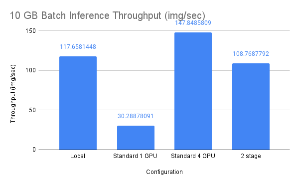
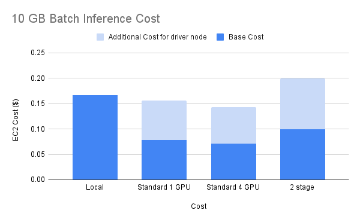
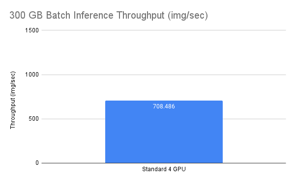

# Batch Inference Benchmarking with Spark

This repo contains benchmarks for batch inference benchmarking with Spark.

We use the image classification task from the [MLPerf Inference Benchmark suite](https://arxiv.org/pdf/1911.02549.pdf) in the offline setting.
    
- Images from ImageNet 2012 Dataset
- ResNet50 model

The workload is a simple 3 step pipeline:
Read from S3 -> Preprocess images [CPU] -> Predict [GPU]

Images are saved in parquet format (with ~1k images per parquet file). 

We tried with two dataset sizes, 10 GB and 300 GB. These sizes are for when the data is loaded in memory. The compressed on-disk size is much smaller.

We also run a microbenchmark to measure overhead from Spark.

All experiments are run in Databricks using Databricks Runtime v12.0, and using the ML GPU runtime when applicable.

## 10 GB
10 GB dataset using a single-node cluster.

### Configurations

- **Local**: `g4dn.16xlarge` instance (1 GPU). This is the smallest `g4dn` instance that does not OOM.
    - Creates a [single-node cluster](https://docs.databricks.com/clusters/single-node.html) which starts Spark locally on the driver.
    - Local clusters do not support GPU scheduling. Spark will schedule tasks based on available CPU cores.
        - We have to manually repartition the data between the preprocessing and prediction steps to match the number of GPUs.
        - We cannot use multi-GPU machines since we cannot specify the CUDA visible devices for each task.
    - [Code](code/torch-batch-inference-s3-10G-single-node.ipynb)
        
- **Standard**. Creates a standard Databricks cluster.
    - This starts a 2 node cluster: 1 node for the driver that does not run tasks, and 1 node for the executor.
    - Standard clusters support GPU scheduling
        - However, since Spark fuses all stages, the effective parallelism is limited by the # of GPUs.
    - Two different instance types:
        - **1 GPU**: `g4dn.xlarge`
        - **4 GPU**: `gd4n.12xlarge`
    - [Code](code/torch-batch-inference-s3-10G-standard.ipynb)

- **2 stage**. Use 2 separate clusters: 1 CPU-only cluster for preprocessing, and 1 GPU cluster for predicting. We use DBFS to store the intermeditate preprocessed data. This allows preprocessing to scale independently from prediction, at the cost of having to persist data in between the steps.
    - **CPU cluster**: 1 `m6gd.12xlarge` instance with Photon acceleration enabled. This is the smallest `m6gd` instance that does not OOM.
    - **GPU cluster**: 1 `g4dn.12xlarge` instance.
    - [CPU Code](code/torch-batch-inference-10G-s3-cpu-only.ipynb)
    - [GPU Code](code/torch-batch-inference-10G-s3-predict-only.ipynb)

### Results




## 300 GB

We pick the best configuration from the 10 GB experiments, and scale up to more nodes for inference on 300 GB data.

[Code](code/torch-batch-inference-300G-s3-standard.ipynb)

4 `g4dn.12xlarge` instances.


## Microbenchmark
Run a microbenchmark that reads from S3 and does a dummy preprocessing step with `time.sleep(1)`.

[Full code is here](code/microbenchmark.ipynb)

We force execution of the read before executing preprocessing to isolate just the preprocessing time.

We expect that the preprocessing step takes ~1 second, but it takes **84.838** seconds instead.

Profiling shows that the actual UDF execution is 1 second, so the additional time is coming from some other Spark overhead.

```
============================================================
Profile of UDF<id=56>
============================================================
         48 function calls in 16.015 seconds

   Ordered by: internal time, cumulative time

   ncalls  tottime  percall  cumtime  percall filename:lineno(function)
       16   16.014    1.001   16.014    1.001 {built-in method time.sleep}
       16    0.000    0.000   16.015    1.001 <command-566047737056994>:7(dummy_preprocess)
       16    0.000    0.000    0.000    0.000 {method 'disable' of '_lsprof.Profiler' objects}
```

## Stage level Scheduling
We also tried enabling [stage level scheduling](https://books.japila.pl/apache-spark-internals/stage-level-scheduling/) to maximize both CPU and GPU parallelism without having to use two separate clusters.

1. Start a standard cluster with `g4dn.12xlarge` instance (4 GPUs)
2. Set `spark.task.resource.gpu.amount` to `# GPU/# CPU==1/12==0.0833` during cluster startup. This is to prevent GPU from limiting parallelism during reading+preprocessing stage.
3. After the preprocessing stage, use create a new `TaskResourceRequest` with 1 GPU per task. Run prediction on the preprocessed RDD with the newly created `TaskResourceRequest`.

However, the inference stage is not respecting the new resource request, leading to more parallelism than available GPU and CUDA OOM.

[Full code is here](code/torch-batch-inference-10G-stage-level-scheduling.ipynb)


