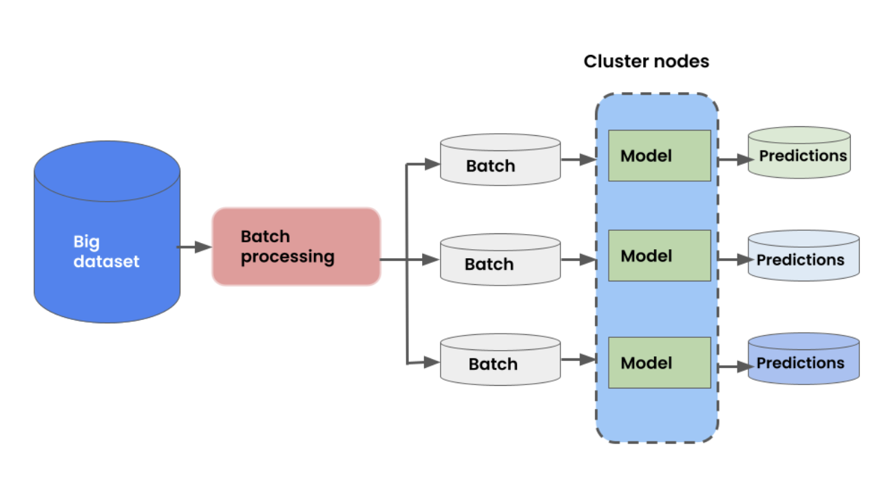

# Batch Inference Benchmarking with Ray

This repo contains benchmarks for batch inference benchmarking with [Ray Data](https://docs.ray.io/en/latest/data/dataset.html).

We use the image classification task from the [MLPerf Inference Benchmark suite](https://arxiv.org/pdf/1911.02549.pdf) in the offline setting.
    
- Images from ImageNet 2012 Dataset
- ResNet50 model

The workload is a simple 3 step pipeline:

Images are saved in parquet format (with ~1k images per parquet file). 

We tried with two dataset sizes, 10 GB and 300 GB. These sizes are for when the data is loaded in memory. The compressed on-disk size is much smaller.

We also run a microbenchmark to measure overhead from Spark.

All experiments are run in Databricks using Databricks Runtime v12.0, and using the ML GPU runtime when applicable.

## 10 GB
10 GB dataset using a single-node cluster.

### Configurations
- 1 `gd4n.12xlarge` instance. Contains 48 CPUs and 4 GPUs.
- Experiments were all run on the [Anyscale platform](https://www.anyscale.com/).
- Uses [Ray Data](https://docs.ray.io/en/latest/data/dataset.html) [nightly version](https://docs.ray.io/en/latest/ray-overview/installation.html#daily-releases-nightlies). 
- [Code](ray/code/ray-10G.py)

**Throughput**: 312.460 img/sec

## 300 GB

We scale up to more nodes for inference on 300 GB data. Uses 4 `g4dn.12xlarge` instances., 16 GPUs in total. 

[Code](code/ray-300G.py)

**Throughput**: 2658.314 img/sec

## 10 TB

We scale up to even more nodes for inference on 10 TB data. Since deep learning workloads are often memory contrained, we use
a heterogenous cluster consisting of some GPU nodes and some CPU-only nodes to fully maximize throughput and GPU utilization.

The cluster consists of:
- 10 `g4dn.12xlarge` instances
- 10 `m5.16xlarge` instances

**Throughput** 11580.958 img/sec

## Microbenchmark
Run a microbenchmark that reads from S3 and does a dummy preprocessing step with `time.sleep(1)`.

[Full code is here](code/microbenchmark.py)

We force execution of the read and cache the result before executing preprocessing to isolate just the preprocessing time.

Preprocessing takes **4.383** seconds.

